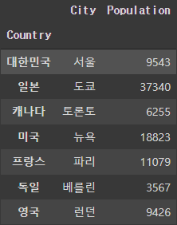
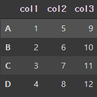

# pandas

파이썬 데이터 처리를 위한 라이브러리

``` python
import pandas as pd
import numpy as np
```

이를 기본으로 import 하여 사용한다.


### 1.Seris

- 1차원 데이터
- 인덱스(index) + 값(value)

```python
s = pd.Series([3, 5, 7, 9])
print(s)
>> 0    3
   1    5
   2    7
   3    9
   dtype: int64

s2 = pd.Series([3, 5, 7, 9], index=['a', 'b', 'c', 'd'])
print(s2)
>> a    3
   b    5
   c    7  
   d    9
   dtype: int64
    
s.index
>> RangeIndex(start=0, stop=4, step=1)

s.values 
>> array ([3, 5, 7, 9])
-> 기본값이 array인 이유는 numpy가 기본이기 때문이다.

s2['a']
>> 3

s2[0]
>> 3
-> 인덱스 값이 'a' 주어졌지만,  숫자로도 접근이 가능하다.
   하지만 준 값이 있다면 준 값을 사용하는 것이 좋다.
   또한 숫자 자체를 '1'과 같이 인덱스 값으로 줄 수 있지만, 혼동을 유발하므로 되도록이면 지양

pop_dict = {'서울':9543,
            '도쿄':37340,
            '토론토':6255,
            '뉴욕':18823,
            '파리':11079,
            '베를린':3567,
            '런던':9426
            }
population = pd.Series(pop_dict)
population
>> 서울      9543
   도쿄     37340
   토론토     6255
   뉴욕     18823
   파리     11079
   베를린     3567
   런던      9426
   dtype: int64
        
pop_dict['서울']
population['서울']
population[0]
>> 9543

pop_dict[0]
-> 할 경우 에러가 발생하는데, 딕셔너리는 key 값으로 인덱싱하기 때문이다.

pop_dict.keys()
dict_keys(['서울', '도쿄', '토론토', '뉴욕', '파리', '베를린', '런던'])

population * 100
>> 서울      9543000
   도쿄     37340000
   토론토     6255000
   뉴욕     18823000
   파리     11079000
   베를린     3567000
   런던      9426000
   dtype: int64
-> numpay 를 기본으로 하기 때문에 이와 같은 연산도 가능하다.
```


### 2. DataFrame

- 여러 개의 Series 가 모여 하나의 테이블 형식의 데이터를 생성할 수 있다. 
- 2차원 데이터

```python
# 리스트로 DataFrame 만들기
data = [
        ['대한민국','서울',9543],
            ['일본','도쿄',37340],
            ['캐나다','토론토',6255],
            ['미국','뉴욕',18823],
            ['프랑스','파리',11079],
            ['독일','베를린',3567],
            ['영국','런던',9426]
]

df = pd.DataFrame(data)

df

```


```python
# 컬럼명 지정
df = pd.DataFrame(data, columns=['Country','City','Population'])    

df
```


```python
# 딕셔너리를 통해 DataFrame 만들기
-> 리스트와 달리, 컬럼명을 지정하면서 DataFrame 을 생성할 수 있다.

data = {
    'Country':['대한민국', '일본', '캐나다', '미국', '프랑스', '독일', '영국'],
    'City':['서울','도쿄','토론토','뉴욕','파리','베를린','런던'],
    'Population':[9543, 37340, 6255, 18823, 11079, 3567, 9426]
}
df = pd.DataFrame(data)
print(df)

```

```python
# type
type(df)
>> pandas.core.frame.DataFrame

type(df['Country'])
>> pandas.core.series.Series

# DataFrame에 관한 정보 얻기
df['Country']
>> 0    대한민국
   1      일본
   2     캐나다
   3      미국
   4     프랑스
   5      독일
   6      영국
   Name: Country, dtype: object
            
df.index
>> RangeIndex(start=0, stop=7, step=1)

df.columns
>> Index(['Country', 'City', 'Population'], dtype='object')

df.dtypes
>> Country       object
   City          object
   Population     int64
   dtype: object
        
df.values
>> array([ ['대한민국', '서울', 9543],
           ['일본', '도쿄', 37340],
           ['캐나다', '토론토', 6255],
           ['미국', '뉴욕', 18823],
           ['프랑스', '파리', 11079],
           ['독일', '베를린', 3567],
           ['영국', '런던', 9426]], dtype=object)

df['Country'] + df['City']
>> 0    대한민국서울
   1      일본도쿄
   2    캐나다토론토
   3      미국뉴욕
   4     프랑스파리
   5     독일베를린
   6      영국런던
   dtype: object

# info를 통해 DataFrame에 관한 정보를 얻을 수 있다.
df.info()
>> <class 'pandas.core.frame.DataFrame'>
   RangeIndex: 7 entries, 0 to 6
   Data columns (total 3 columns):
   #   Column      Non-Null Count  Dtype 
  ---  ------      --------------  ----- 
   0   Country     7 non-null      object
   1   City        7 non-null      object
   2   Population  7 non-null      int64 
   dtypes: int64(1), object(2)
   memory usage: 296.0+ bytes

```


```python
# set_index : 특정 컬럼을 인덱스로 만들기
df_index_with_country = df.set_index('Country')
print(df_index_with_country)
-> 컬럼을 인덱스로 지정하기 전에는 0, 1, 2 등 자동으로 생성된 숫자가 인덱스 였으나,
   set_index 를 통해 Country 컬럼을 인덱스로 지정하였다.
```




```python
# loc : 로케이션을 통한 인덱싱
df_index_with_country.loc['대한민국']
>> City            서울
   Population    9543
   Name: 대한민국, dtype: object
```


```python
# 또 다른 DataFrame 생성 방법
s1 = pd.Series([1,2,3,4], index=['A','B','C','D'])
s2 = pd.Series([5,6,7,8], index=['A','B','C','D'])
s3 = pd.Series([9,10,11,12], index=['A','B','C','D'])

data = {
    'col1':s1,
    'col2':s2,
    'col3':s3,
}

df4 = pd.DataFrame(data, index=['A','B','C','D'])

df4
```




### 3 Import / Export

- DataFrame 불러오기/내보내기

```python
# Export : to를 이용한다.
json_data = df.to_json()

# Import : read를 이용한다.
pd.read_json(json_data)

# csv 파일로 불러오기
!wget -O 'iris_sample.csv' https://raw.githubusercontent.com/duc-ke/edu_jupyter_pandas/master/dataset/iris_sample.csv
    
df_iris = pd.read_csv('iris_sample.csv')

pd.read_csv('iris_sample.tsv', sep='\t')
-> csv 파일은 \t 로 구분을 해줘야 보기 편하다.
```


